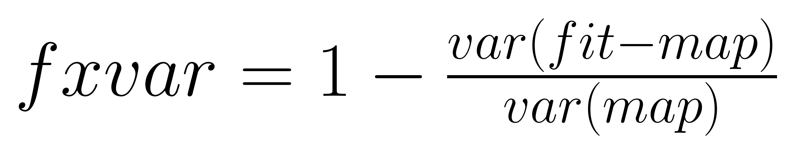

# Gaussian 2D Fitting

This repository contains code to fit a 2D Gaussian model to given data. It includes examples of fitting a single Gaussian, a sum of two Gaussians, and using multiprocessing to fit multiple images.

## Requirements

The code requires Python 3.x and depends on the following libraries:

- numpy
- matplotlib
- scipy
- tqdm

A `requirements.txt` file is provided to install these dependencies.

## Gaussian 2D Fitting

Simply move the `gaussian_2d_fitting.py` file to the directory where you want to run the code.

```python
from gaussian_2d_fitting import fit_2d_gaussian

param_estimate, param_sem = fit_2d_gaussian(numpy_2d_array, plot=True, show=True)
```

where `param_estimate` and `param_sem` are NamedTuple objects containing the following estimated parameters:

```python
class GaussianParameters(NamedTuple):
    """
    amplitude: int or float
        The amplitude of the Gaussian, i.e., the max of the Gaussian if the
        offset is zero. Unitless.
    mu_x & mu_y: int or float
        The center coordiates of the Gaussian, in unit pixels.
    sigma_1 & sigma_2: int or float
        The std. dev. of the two orthogonal axis in unit pixels. sigma_1
        should be the horizontal axis if theta = 0 degree.
    theta: int or float
        The angle of the sigma_1 away from the positive x-axis, measured
        counterclockwise in unit degrees.
    offset: int or float
        The offset of the Gaussian. Unitless.
    """
    amplitude: float
    mu_x: float
    mu_y: float
    sigma_1: float
    sigma_2: float
    theta: float
    offset: float
```

Simply use the dot notation to access the parameters, e.g., `param_estimate.amplitude`.

## Calculate the Fraction of Explained Variance

The `calc_f_explained_var(sum_map: np.ndarray, params: GaussianParameters) -> float` function calculates the fraction of explained variance of the fitted Gaussian model.

```python
fxvar = calc_f_explained_var(numpy_2d_array, param_estimate)
```

<p style="text-align:center;">
  
</p>

Here:

- *fit* is the map reconstructed with fit parameters.
- *map* is the original map constructed by summing bars.
- *var(•)* denotes the variance of the given expression.

## Examples

Look at the `examples.py` file for examples of:

1. Fitting a 2D Gaussian to a single Gaussian.

<p style="text-align:center;">
  
</p>

2. Fitting a 2D Gaussian to a sum of two Gaussians.

<p style="text-align:center;">
  
</p>


3. Using multiprocessing to fit multiple images and save the fit in a multipage PDF file.

- A PDF file (`results/fit_results.pdf`) containing the plots of the fitted Gaussians.
- A text file (`results/fit_results.txt`) containing the estimated parameters, standard errors, and explained variances for each fit.
